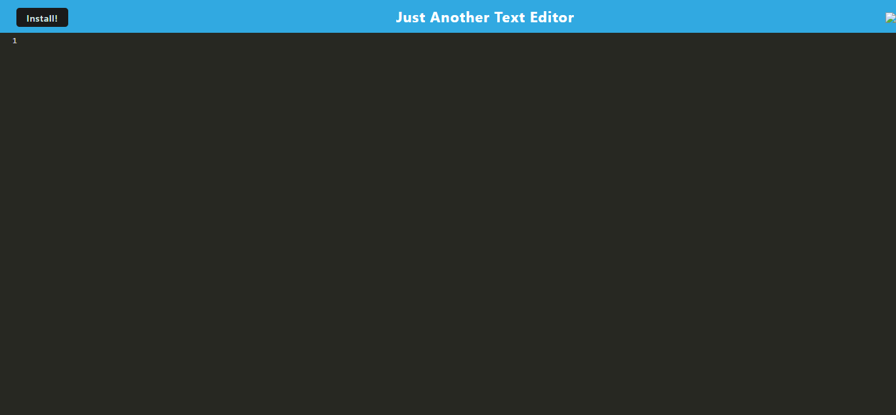

# PWA-Text-Editor

#PWA 
I was asked to use preexisting code to allow for the installation of a pwa.

## Installation
I employed webpack, htmlhotmodule, babel for loader and service worker.
1. I deployed my project using render. A link and screenshot are provided below:
1. render url: https://pwa-text-editor-6enz.onrender.com/
2. Deployed Site Screenshot: 

## Usage
This PWA will allow the user to input and save text and install the application for offline access.
```

## Contributing
There was one contributor to this project. ME!!!!:
1. Samuel Wlodawski

## License

I employed no license in the creation of this project.